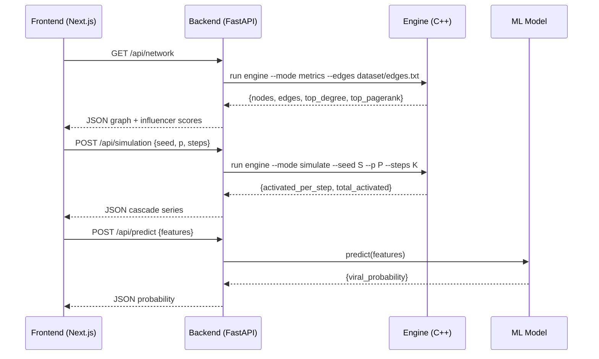
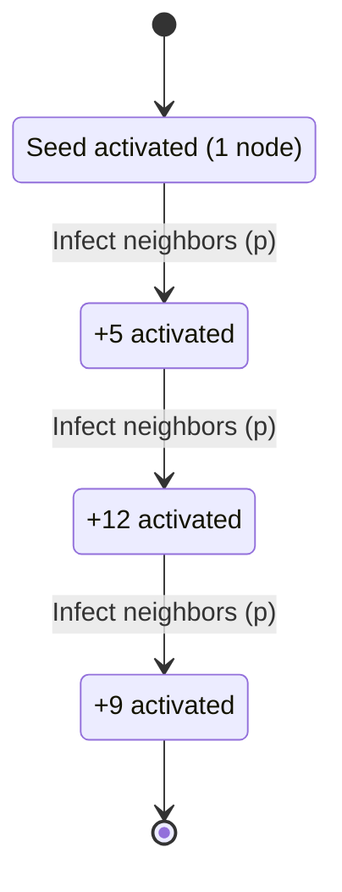

# AlgoInfluencers

AI-powered Influence Propagation & Viral Content Prediction System

A full‑stack analytics platform that models social networks as graphs, simulates information diffusion (Independent Cascade), and predicts virality using machine learning. Built with a high‑performance C++ graph engine, a Python FastAPI backend, and a Next.js dashboard.


## Highlights
- C++17 Graph Engine: PageRank, Degree centrality, Independent Cascade simulation
- Python FastAPI: Clean REST API surface for simulation, network analytics, and ML prediction
- Next.js (React): Interactive dashboard with network visualization and analytics panels
- Real datasets ready: SNAP/Kaggle compatible edge‑list ingestion


## Repository Structure
```
AlgoInfluencers/
├── backend/
│   ├── app/
│   │   ├── api/
│   │   │   ├── network.py
│   │   │   ├── predict.py
│   │   │   └── simulation.py
│   │   ├── models/
│   │   │   ├── diffusion.py
│   │   │   ├── graph.py
│   │   │   └── ml_predictor.py
│   │   ├── __init__.py
│   │   └── main.py
│   └── requirements.txt
├── cpp_engine/
│   └── main.cpp
├── dataset/
│   └── edges.txt
├── frontend/
│   ├── src/
│   │   ├── app/
│   │   ├── components/
│   │   └── lib/
│   ├── package.json
│   └── next.config.ts
├── LICENSE
├── README.md
└── run.sh
```


## System Architecture
```
Next.js Dashboard  ──►  FastAPI Backend  ──►  C++ Graph Engine
        │                         │                 │
        │                         └──►  ML Model ◄──┘
        └────────────── Visualizations & Controls
```
- Frontend (Next.js): Network graph, simulation controls, and prediction UI
- Backend (FastAPI): HTTP API, data orchestration, ML inference, engine bridge
- Engine (C++): Graph analytics + diffusion simulation at native speed
- ML (scikit‑learn): Viral probability prediction (pickle‑loaded model)


## C++ Graph Engine
Single‑binary engine that loads a directed edge list, computes metrics, and runs Independent Cascade.

Build (macOS/Linux):
```
mkdir -p cpp_engine/bin
g++ -O3 -std=c++17 cpp_engine/main.cpp -o cpp_engine/bin/engine
```

Quick test dataset:
```
# already included
cat dataset/edges.txt
```

Run metrics (PageRank + Degree):
```
./cpp_engine/bin/engine --mode metrics --edges dataset/edges.txt --top 10
```

Run Independent Cascade simulation:
```
./cpp_engine/bin/engine --mode simulate --edges dataset/edges.txt \
  --seed 2 --p 0.20 --steps 8
```

Output: JSON to stdout
```
{
  "seed": 2,
  "p": 0.2000,
  "steps": 8,
  "total_activated": 41,
  "activated_per_step": [5, 9, 12, 8, 5, 2, 0, 0]
}
```

Notes
- Input format: space‑separated edge list (u v) per line; nodes are integer labels
- If no --seed is provided, engine auto‑selects the highest‑degree node
- Designed to be called from FastAPI via subprocess and parsed as JSON


## Machine Learning (Virality Prediction)
- Train: notebooks/train_model.ipynb (recommended) or a Python script
- Features (suggested): followers_count, likes, shares, comments, sentiment, post_hour
- Target: viral ∈ {0,1} (e.g., shares in top decile)
- Baseline model: RandomForestClassifier (scikit‑learn)
- Export: backend/app/models/viral_model.pkl
- Serving: backend/app/models/ml_predictor.py loads .pkl and exposes predict()

Example predict payload (JSON):
```
{
  "followers_count": 1200,
  "likes": 140,
  "shares": 45,
  "comments": 20,
  "sentiment": 0.72,
  "post_hour": 18
}
```

Example response:
```
{ "viral_probability": 0.81 }
```


## Backend (FastAPI)
Install deps and run server:
```
cd backend
python -m venv venv
source venv/bin/activate   # Windows: venv\Scripts\activate
pip install -r requirements.txt
uvicorn app.main:app --reload
```

Default docs: http://127.0.0.1:8000/docs

Suggested endpoints:
- GET /api/network      → returns graph snapshot + influencer scores
- POST /api/simulation  → calls C++ engine, returns cascade series
- POST /api/predict     → ML virality probability

Engine bridge (concept):
```
./cpp_engine/bin/engine --mode simulate --edges dataset/edges.txt --seed {id} --p {p} --steps {k}
```
Parse stdout JSON → return as API payload.


## Frontend (Next.js)
Run the dashboard:
```
cd frontend
npm install
npm run dev
```

Key components
- NetworkGraph.tsx: Force‑directed visualization (nodes/edges; influencer highlighting)
- SimulationPanel.tsx: Seed selection, p, steps → triggers /api/simulation
- ViralPrediction.tsx: Feature form → /api/predict → gauge/chart output


## Data
This repo includes a small sample edge list (dataset/edges.txt). For real experiments:
- Stanford SNAP (Twitter, ego networks, Higgs boson diffusion)
- Kaggle social media interaction datasets

Convert to edge‑list (u v) for ingestion by the C++ engine. For large graphs, sample subgraphs for faster iteration.


## Development Workflow
1) Engine first: validate metrics + IC locally (JSON outputs)
2) ML next: train and export viral_model.pkl; confirm loader works
3) Backend: wire /api/simulation to engine; /api/predict to ML
4) Frontend: visualize network; wire controls to APIs; add analytics charts


## Visualization Guide

### Live Demo (Local)
1) Start backend
```
cd backend
python -m venv venv && source venv/bin/activate  # Windows: venv\Scripts\activate
pip install -r requirements.txt
uvicorn app.main:app --reload
```
2) Start frontend
```
cd frontend
npm install
npm run dev
```
3) Open the dashboard at http://localhost:3000 and:
- Load the network (it will request /api/network)
- Select a seed node, probability p, steps
- Click Simulate to visualize cascade growth over time
- Use the Viral Prediction panel to submit features and view the probability output


### Architecture Diagram (Mermaid)
```mermaid
flowchart LR
  A[Next.js Dashboard] -->|HTTP| B[FastAPI Backend]
  B -->|subprocess JSON| C[C++ Engine]
  B -->|pickle inference| D[ML Model (scikit-learn)]
  C -->|metrics / cascade| B
  D -->|viral probability| B
  B -->|JSON| A
```

### Data Flow (Mermaid)


### Diffusion Cascade Example (IC)


### Screenshots (placeholders)
Add screenshots to a docs/ directory and reference them here.
- Network Graph: 
- Cascade Simulation: 
- Viral Prediction: 

Tip: Use the browser’s dev tools Performance tab to capture an animation GIF and embed it.


## Roadmap
- Add Linear Threshold (LT) diffusion model in C++
- Persist simulations and predictions (SQLite/PostgreSQL) via SQLAlchemy
- Real datasets integration (SNAP/Kaggle) with preprocessing utilities
- Rich analytics (spread vs time, influencer bars, PR distribution)
- Model registry + versioned .pkl artifacts
- Optional: pybind11 bindings for zero‑copy engine integration


## Requirements (summary)
- C++17 compiler (g++/clang++)
- Python 3.9+
- Node.js 18+

Python packages (backend/requirements.txt):
- fastapi, uvicorn, scikit-learn, pandas, numpy (plus any you add)


## License
MIT License. See LICENSE.

